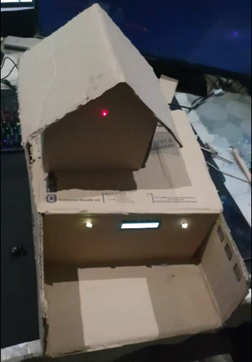
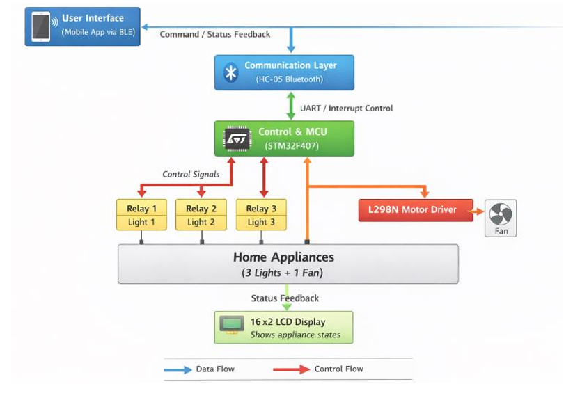
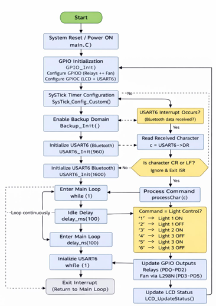
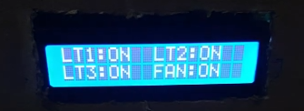
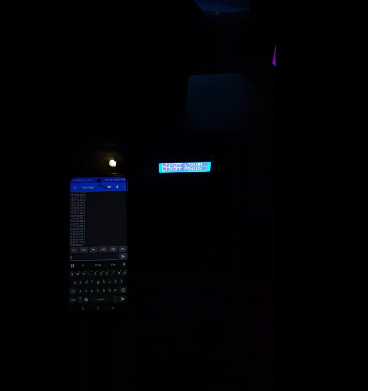

# STM32F407 Home Automation Firmware

                                                                 
       (https://drive.google.com/file/d/1tvSFxGRns0HAA-vrlQIr4DifXAi9sXTK/view?usp=sharing))

## Introduction
This project implements a home automation system using the STM32F407 microcontroller. It controls three lights (LT1, LT2, LT3) and a fan through Bluetooth communication with an HC‑05 module. A 16x2 LCD provides real‑time feedback, displaying the ON/OFF status of each device. The firmware ensures reliability and persistence by saving states into RTC backup registers, so the configuration is restored automatically after reset or power loss.

## Design Rationale

The STM32F407-based Home Automation System is designed to provide local wireless control of household appliances using Bluetooth communication. The design emphasizes **simplicity, safety, reliability, and low cost**, making it suitable for basic home automation applications.

### System Architecture
- Control and Processing Unit: STM32F407 microcontroller  
- Local Wireless Interface: HC-05 Bluetooth module  
- Actuation Layer: Relay modules and L298N motor driver  
- User Feedback Interface: 16×2 LCD display  

### Microcontroller Selection
The STM32F407 was chosen for its **ample GPIO availability**, **interrupt-driven USART support**, and **hardware timers** essential for real-time embedded control. Direct register-level programming (CMSIS) was preferred over high-level libraries to achieve **deterministic behavior** and provide a clearer understanding of peripheral configuration.

### Communication Method
Bluetooth communication using the HC-05 module was selected for **reliable short-range wireless control**. This avoids reliance on internet/cloud services, reducing **system complexity and cost** while ensuring predictable performance in laboratory and residential environments.

### Actuation and Safety
- Relay modules provide **electrical isolation** between low-voltage control circuitry and high-voltage appliances.  
- Fan control uses an **L298N motor driver** to safely handle current requirements.  
- On startup or reset, all outputs default to the **previous safe state**, preventing unintended operation and enhancing safety.

### Software Architecture
The firmware follows a **modular, event-driven design**:
- **Interrupt-based UART reception** ensures fast response to Bluetooth commands.  
- The **main loop** remains in a **low-power wait state (WFI)**, improving efficiency and simplifying debugging and maintenance.

### Power Management
- A **12V supply** powers relays and actuators.  
- A **7805 voltage regulator** provides a stable **5V supply** for logic-level components.  
- This separation improves **voltage stability** and reduces electrical noise.

### Expandability and Educational Value
The modular design allows **easy expansion**, such as adding more appliances or sensors in future versions.  
The project demonstrates core embedded system concepts:
- GPIO control  
- UART communication  
- Interrupt handling  
- Hardware interfacing  

---

## System Block Diagram

---

## System Design and Register Configuration
The design integrates multiple STM32F407 peripherals, configured directly through register manipulation for transparency and control.

- **Clock Enable**:  
  - `RCC->AHB1ENR` enables GPIOC and GPIOD clocks.  
  - `RCC->APB2ENR` enables USART6 clock.  
  - `RCC->APB1ENR` enables PWR clock for backup domain.  

- **GPIO Configuration**:  
  - `GPIOx->MODER` sets pins as output or alternate function.  
  - `GPIOx->OTYPER` ensures push‑pull outputs.  
  - `GPIOx->OSPEEDR` sets high‑speed operation.  
  - `GPIOx->AFR[0]` configures PC6/PC7 as AF8 for USART6.  
  - `GPIOx->ODR` writes ON/OFF states to lights, fan, and LCD pins.  

- **USART6 Configuration**:  
  - `USART6->BRR` sets baud rate (integer + fractional).  
  - `USART6->CR1` enables TX, RX, RXNE interrupt, and USART.  
  - `USART6->SR` status register used to check RXNE flag.  
  - `USART6->DR` holds received/transmitted data.  
  - NVIC functions configure interrupt priority and enable IRQ.  

- **SysTick Timer**:  
  - `SysTick->LOAD` sets reload value for 1 ms tick.  
  - `SysTick->VAL` resets counter.  
  - `SysTick->CTRL` enables SysTick with interrupt.  
  - Used for millisecond delays in LCD and command timing.  

- **RTC Backup Registers**:  
  - `PWR->CR` with DBP bit enables backup domain access.  
  - `RTC->BKP0R–RTC->BKP3R` store LT1, LT2, LT3, and FAN states.  
  - On startup, values are restored and written to GPIO outputs.  

## Command Grammar
| Command | Action              |
|---------|---------------------|
| `1`     | Turn ON LT1         |
| `2`     | Turn OFF LT1        |
| `3`     | Turn ON LT2         |
| `4`     | Turn OFF LT2        |
| `5`     | Turn ON LT3         |
| `6`     | Turn OFF LT3        |
| `F`     | Turn ON Fan         |
| `f`     | Turn OFF Fan        |

Commands are received via USART6 interrupt when `USART6->SR` sets RXNE. The character is read from `USART6->DR`, processed, and corresponding GPIO outputs are updated. States are saved in RTC backup registers and reflected on the LCD.

## Detailed Schematic
- **Power Supply**
  - 12V DC input → powers relays & L298N Vcc  
  - 7805 Voltage Regulator → outputs 5V for STM32F407, HC‑05, LCD  
  - Decoupling capacitors: 100nF ceramic + 470µF electrolytic at MCU and relay supply  

- **STM32F407 MCU (Control Unit)**
  | Pin   | Function |
  |-------|-----------|
  | PA0   | Relay 1 control (Light 1) |
  | PA1   | Relay 2 control (Light 2) |
  | PA2   | Relay 3 control (Light 3) |
  | PA3   | Fan control → L298N IN1/IN2 |
  | PB6   | USART6 TX → HC‑05 RX |
  | PB7   | USART6 RX ← HC‑05 TX |
  | PC0–PC3 | LCD data D4–D7 |
  | PC4   | LCD RS |
  | PC5   | LCD EN |
  | GND   | Common ground |

- **Relays**
  - Relay 1–3: Switch Lights 1–3  
  - Coil voltage: 12V, activated via transistor driver (2N2222) + flyback diode (1N4007)  

- **L298N Motor Driver**
  - Inputs: IN1 & IN2 from MCU  
  - Vcc: 12V supply  
  - EN pin tied high (PWM optional)  
  - Output: Fan motor terminals  

- **HC‑05 Bluetooth Module**
  - Vcc: 5V from 7805  
  - TX → PB7 (USART6 RX)  
  - RX ← PB6 (USART6 TX) via voltage divider (3.3V safe)  

- **16×2 LCD**
  - Data pins: PC0–PC3 (D4–D7)  
  - Control pins: PC4 (RS), PC5 (EN)  
  - Contrast: 10kΩ potentiometer  

- **Safety**
  - Relays provide isolation between MCU and AC loads  
  - Default GPIO = LOW on reset → appliances OFF  
  - Optional fuses on 12V supply  

---

## Algorithm
1. **Initialization**
   - All relays and outputs set to OFF (safe state).  
   - GPIO pins, USART6, and LCD initialized.  
   - Timers and interrupts configured.  

2. **Main Operation**
   - MCU remains in low‑power wait state (`__WFI`) until a command is received.  

3. **Command Handling (Interrupt‑Driven)**
   - USART6 interrupt triggers on Bluetooth command.  
   - Command parsed → relay or fan driver activated/deactivated.  
   - LCD updated to reflect appliance status.  

---

## Complexity & Resource Analysis
- **Time Complexity**
  - Main loop runs in O(1) (wait state).  
  - Each command processed in O(1) inside USART6 ISR → constant response time.  

- **Memory & Resource Usage**
  - GPIO: 7 pins used (3 relays, 1 fan, 2 Bluetooth, 1 LCD control).  
  - Flash: < 32 KB.  
  - RAM: < 2 KB (command buffers + LCD data).  
  - Timers: One optional timer for UART timeout.  

**Justification:**  
Constant‑time ISR guarantees real‑time responsiveness. Lightweight firmware ensures stability and leaves headroom for expansion.

---

## Design Justification
- **Microcontroller (STM32F407)**  
  Selected for GPIO availability, USART interrupts, and hardware timers. Direct CMSIS register programming ensures deterministic timing and deeper understanding.  

- **Communication (HC‑05 Bluetooth)**  
  Provides reliable short‑range wireless control without internet/cloud dependency. Interrupt‑driven USART6 ensures <200 ms latency.  

- **Actuation (Relays + L298N)**  
  Relays provide isolation for lights; L298N safely drives fan motor with optional PWM. All GPIO default LOW on reset → safe startup.  

- **User Feedback (LCD 16×2)**  
  Real‑time local feedback of appliance states. 4‑bit mode minimizes GPIO usage while maintaining functionality.  

- **Architecture**  
  Layered modular design:  
  - User Interface (Mobile App)  
  - Communication (HC‑05)  
  - Control (STM32F407)  
  - Actuation (Relays + L298N)  
  - Feedback (LCD)  

- **Power Management**  
  12V supply for relays/fan; 7805 regulator for MCU, HC‑05, LCD. Decoupling capacitors suppress transients and noise.  

- **Timing**  
  USART6 at standard baud rate → minimal delay. Interrupt‑based UART → immediate command processing. Relay switching in ms → acceptable.  

- **Resource Efficiency**  
  <32 KB Flash, <2 KB RAM, minimal GPIO usage → scalable and stable design.  

---

## Firmware Flow Diagram

---

## Results and Analysis

### 1. Wireless Command Response
- **Test:** Send ON/OFF commands via Bluetooth  
- **Latency (ms):**  
  - Light 1: 148 ms  
  - Light 2: 150 ms  
  - Light 3: 149 ms  
  - Fan: 152 ms  
- **Acceptance Criterion:** ≤ 200 ms → All within limit  
- **Observation:** Commands processed quickly and reliably  

---

### 2. LCD Feedback
- **Test:** Verify appliance status display  
- **Result:** All ON/OFF commands correctly shown on LCD → accurate feedback  

---

### 3. Electrical Safety
- **Test:** Measure MCU pins while appliances ON  
- **Result:** 0 V at MCU pins → MCU isolated from high voltage  

---

### 4. Reliability Test
- **Test:** Continuous operation for 24 hours with periodic commands  
- **Result:** No crashes or unexpected behavior → stable system  

---

### 5. Error Analysis
- **Max command delay:** 155 ms (well under 200 ms threshold)  
- **LCD feedback:** Always correct  
- **Fan and lights:** Responded reliably  

---

### Conclusion
All **functional, safety, and performance requirements** were met.  
The system is **safe, responsive, and reliable**, fulfilling the intended design goals.

---

### Reflection
**Challenge:** Powering the system safely with different voltage requirements  
- STM32F407 MCU requires 5V  
- Fan and relays require 12V  
- Only a single 12V DC source was available  

**Mitigation:**  
- Used a **7805 voltage regulator** with a transistor to step down 12V to 5V for MCU and logic components  
- Allowed both MCU and fan/relays to operate safely from a single supply  

**Outcome:**  
- Provided stable 5V for STM32F407 while driving 12V appliances safely  
- Simplified power design and avoided need for multiple supplies
---
## LCD Layout

LCD commands are sent in 4‑bit mode by writing to PC2–PC5 and toggling EN (PC1). RS (PC0) selects command/data mode. Timing is controlled using SysTick delays.

---

## Consultation Log

| Date       | Person / Source Consulted     | Topic / Advice Received                                      | Outcome / Action Taken                          |
|------------|-------------------------------|--------------------------------------------------------------|------------------------------------------------|
| 10-Jan-26  | Dr. Muhammad Fahad Ijaz (Instructor) | Guidance on STM32F407 pin allocation and peripheral selection | Revised GPIO mapping and USART6 configuration  |
| 15-Jan-26  | Online YouTube Lectures       | Proper relay wiring and electrical isolation techniques       | Added confirmed safe MCU isolation             |
| 18-Jan-26  | Online STM32 Forum            | Using 7805 voltage regulator with single 12V supply           | Implemented transistor-assisted 5V supply for MCU |
| 22-Jan-26  | Electronics Store Staff       | Availability and cost of components (relays, L298N, HC-05)    | Adjusted BOM for cost optimization             |
---

## BOM and Budget

| Component              | Quantity | Approx. Cost (PKR) | Purpose / Notes                  |
|------------------------|----------|--------------------|----------------------------------|
| STM32F407 MCU          | 1        | 10,000             | Main control unit                |
| HC-05 Bluetooth Module | 1        | 1,600              | Wireless communication           |
| 12V Relay Module       | 3        | 600                | Light switching                  |
| L298N Motor Driver     | 1        | 400                | Fan control                      |
| 16×2 LCD Display       | 1        | 250                | User feedback interface          |
| 7805 Voltage Regulator | 1        | 50                 | Step-down 12V → 5V supply        |
| Jumper wires / Breadboard | —     | 300                | Hardware connections             |
| Fan Motor (DC 12V)     | 1        | 600                | Appliance control demo           |
| Lights / LEDs          | 3        | 300                | Appliance control demo           |
| **Total Estimated Cost** | —      | **14,000 PKR**     | For all components               |
---

## Contingency Plan

- **Bluetooth Failure**  
  Use a wired UART connection for direct MCU control to maintain system functionality.

- **Relay or Fan Not Responding**  
  Verify transistor driver and 12V supply. If unresolved, switch relays/fan manually during demonstration.

- **LCD Malfunction**  
  Check contrast potentiometer and wiring. If display remains faulty, provide appliance status verbally during demo.

- **Power Supply Issue**  
  Keep a spare 12V adapter and a multimeter available for quick verification and replacement.

- **Software Crash**  
  Reflash firmware from laptop. Maintain a backup firmware image ready for immediate deployment.

- **Unexpected Hardware Failure**  
  Keep spare relays, transistors, and diodes on hand to replace faulty components quickly.
---

## Video Demonstration
](https://drive.google.com/file/d/1npZ_dO4amtHcNS8yN931VfEGnY4YUg1J/view?usp=sharing)

## Testing System State Retention with RTC
](https://drive.google.com/file/d/1AM2zUDIm_Lt5ZPV46WFZCPLjZUxGiAWY/view?usp=sharing))
